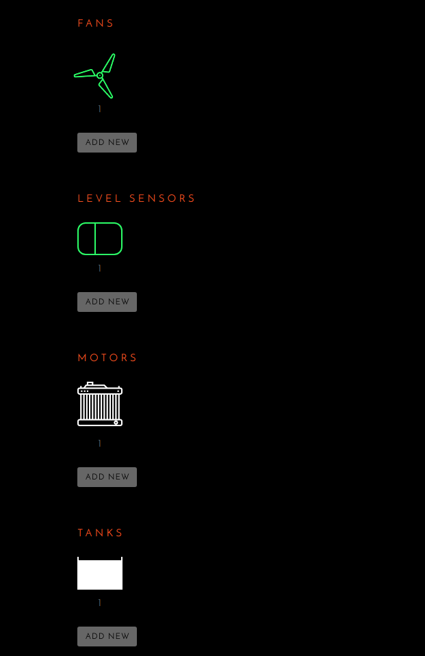
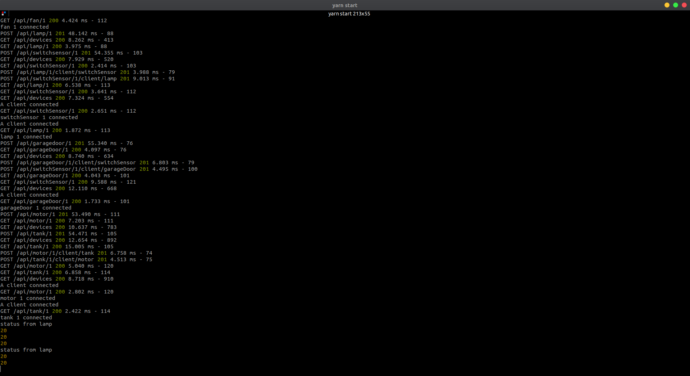
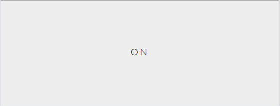
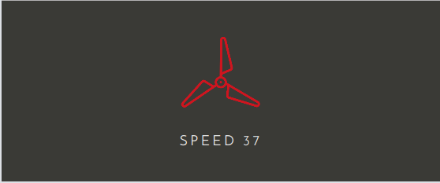
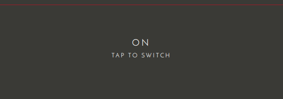
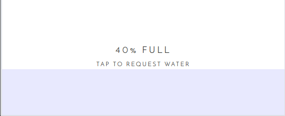

# iot
A simple server to enable iot devices to communicate with each other with mock clients, written in HTML and Python.

## Running Instructions
- Clone the repository, and run `yarn` or `npm install` to install the dependencies.
- Start an instance of MongoDB on port 27017.
- Run `yarn start` or `npm start` to start the server.
- Open the client app by opening the `index.html` file in a web browser, and enter `localhost:3000` in the address field.
- Open the different clients by opening their respective `index.html` files in a web browser and connecting them to `localhost:3000`.

**NOTE: Clients need to be added in the client app first, each individual client is configured to be id 1, and ids in clusters start from id 2**

## Screenshots
### The client application

### The server logs

### The lamp client.

### The fan client.

### The garage door client.

### The level sensor client.

### The switch sensor client.

### The motor client.

### The tank client.

